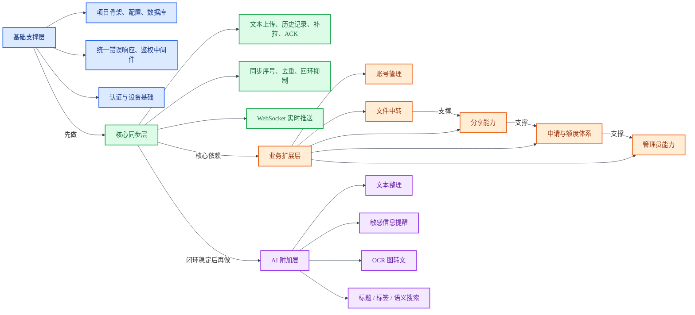
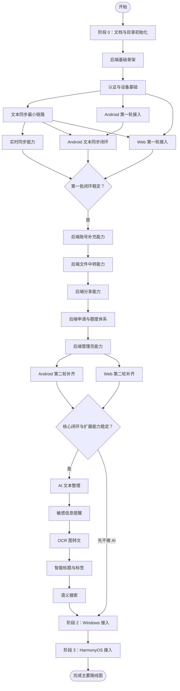

# ClipBridge 开发路线图

## 1. 总体顺序

本项目严格按照下面的顺序推进：

1. 后端 + Android + Web 联合开发
2. Windows
3. HarmonyOS

这个顺序的原因是：

- 后端、Android、Web 三者之间依赖最强，联合推进效率更高
- Android 最适合最早验证真实剪切板同步链路
- Web 可以尽早复用后端接口，提前形成可展示的管理端
- Windows 端桌面特性和打包复杂度较高，适合放在第二阶段
- HarmonyOS 可以尽量复用前面已经稳定的接口和页面思路，放最后成本最低

## 2. 阶段 0：项目初始化（已完成）

### 目标

- 写清需求、架构、路线图
- 建立顶层目录结构
- 明确旧项目参考范围

### 当前产出

- `README.md`
- `docs/requirement.md`
- `docs/architecture.md`
- `docs/roadmap.md`

## 3. 功能分解树

下面先把当前功能清单整理成一个更粗粒度的项目级分解树。
这一版不再拆到太细的接口级功能，而是按“模块分组 + 依赖关系”展示，方便做排期和讲解。

## 4. 开发安排流程图

下面把开发安排按“先依赖底层、再接入上层、最后补扩展”的顺序整理成流程图，便于后续排期时直接参考。

## 5. 阶段 1：后端 + Android + Web 联合开发

第一阶段不是完全串行，而是后端、Android、Web 联合推进。
不过实际依赖关系仍然是以后端接口为核心，Android 优先打通同步闭环，Web 优先打通管理后台骨架。

### 1.1 第一批必须完成

第一批的目标不是把所有功能铺开，而是先打通“账号登录 + 文本同步 + 历史记录 + 基础管理页面”的最小闭环。
实现顺序必须按依赖推进，避免先写上层页面、后补底层接口。

#### 第 1 步：后端基础骨架（5.22已完成）

先完成最基础、最不会返工的部分：

- 创建后端项目骨架
- 配置加载
- 数据库连接
- 健康检查接口
- 统一错误响应格式
- 统一鉴权中间件骨架

这一阶段的目标是让服务可以启动、数据库可以连通、接口有统一返回格式。

#### 第 2 步：认证与设备基础（5.25已完成）

在服务能稳定启动后，先做账号和设备最基础的能力：

- 用户注册
- 用户登录
- Refresh Token 刷新
- 退出登录
- 登录时自动登记当前设备
- 当前账号信息接口
- 设备列表接口

这一阶段完成后，后端、Web 管理端，以及 Android 的登录 / 注册界面就可以先打通认证与设备基础流程。

#### 第 3 步：文本同步最小链路(已完成)

在登录链路可用后，先做最核心的文本同步基础能力：

- 文本剪切板上传接口
- 历史记录查询接口
- 同步补拉接口
- ACK 接口
- 按用户递增的同步序号
- 基础去重字段设计

这里先保证“能同步、能补拉、能查历史”，暂时不追求文件、分享、管理员等扩展能力。

#### 第 4 步：实时同步能力（已完成）

在轮询补拉链路打通后，再补实时能力：

- WebSocket 连接建立
- 登录态校验
- 后端推送新的剪切板事件
- 源设备回环抑制
- 基础心跳与断线重连约定

这样做比一开始就上 WebSocket 更稳，因为即使实时推送还不稳定，系统也已经能靠补拉正常工作。

#### 第 5 步：Android 第一轮接入（已完成）

Android 按下面顺序接入，不要一开始就上后台常驻和复杂入口：

- 创建 Android 项目骨架
- 登录页
- 保存服务地址
- 登录后进入主页面
- 接入当前账号信息读取
- 接入历史记录页
- 支持手动上传一段文本
- 支持手动拉取远端历史

这一步的目标是先验证 Android 和后端的基本通信没有问题。

#### 第 6 步：Android 文本同步闭环（已完成）

在 Android 能稳定登录并请求接口后，再接同步闭环：

- 开启/关闭同步开关
- 监听本地剪切板变化
- 自动上传本地文本
- 自动补拉远端文本
- 写入本地剪切板
- 基础 ACK 回传
- 基础回环抑制

完成后，Android 就能和后端形成最小可演示闭环。

#### 第 7 步：Web 第一轮接入（已完成）

Web 先做管理端骨架和最基础的数据展示，不要第一轮就做复杂页面：

- 创建 Web 项目骨架
- 登录页
- 全局请求封装
- 登录态持久化
- Dashboard 基础信息展示
- 当前账号信息展示
- 剪切板历史页
- 设备管理页

第一轮 Web 只要求能“看”和“基础管理”，不要求一开始就覆盖全部高级功能。

### 1.2 第二批继续补齐

第二批是在第一批闭环稳定后，按“文件 -> 分享 -> 申请 -> 管理员”的顺序逐步补强。
这里不能乱序，因为后面的功能大多依赖前面的数据结构和权限体系。

#### 第 1 步：后端账号补充能力

先补账号侧的非核心但常用功能：

- 修改密码
- 账号设置读取与更新
- 更完整的设备管理动作
- 一键下线其他设备

这一阶段完成后，普通用户侧的账号管理会更完整。

#### 第 2 步：后端文件中转能力

文件能力建议先于分享能力，因为分享功能很可能直接复用文件存储和文件元数据：

- 文件上传
- 文件列表查询
- 文件下载
- 文件删除
- 文件重命名
- 文件大小校验
- 文件类型记录
- 文件来源设备记录

做完这一步后，Android 和 Web 才适合正式接入文件中心。

#### 第 3 步：后端分享能力

分享功能建议继续按“文本分享先做，文件分享后做”的顺序推进：

- 文本分享创建
- 文本分享列表
- 公开取件页基础访问
- 分享撤销
- 分享过期时间
- 阅后即焚
- 文件分享创建
- 文件分享下载
- 是否允许复制文本
- 加密分享

这里把最复杂的“加密分享”放在最后，避免一开始把分享逻辑做得过重。

#### 第 4 步：后端申请与额度体系

在普通用户功能基本完整后，再补申请流程：

- 存储配额申请
- 上传/下载带宽申请
- 管理员申请
- 我的申请记录查询

这一步更多是管理能力扩展，不应阻塞前面的核心同步链路。

#### 第 5 步：后端管理员能力

管理员能力放在第二批较后位置，因为它依赖用户、文件、分享、申请这些数据都已经基本成型：

- 管理员设置读取
- 管理员设置更新
- 用户列表查询
- 用户信息更新
- 用户删除
- 配额申请审批
- 带宽申请审批
- 管理员申请审批

#### 第 6 步：Android 第二轮补齐

Android 在后端第二批接口稳定后，再按下面顺序补功能：

- 手动立即同步
- 通知栏前台服务
- 设备管理页
- 账号设置页
- 文件页
- 系统分享上传文本
- 系统分享上传文件
- 选中文本上传

这里先补“同步体验”和“账号管理”，再补系统级分享入口，能减少前期调试压力。

#### 第 7 步：Web 第二轮补齐

Web 第二轮按后台管理常见使用路径补齐：

- 文件中心
- 分享管理页
- 账号设置页
- 申请记录页
- 管理员页面

Web 的复杂管理页面应尽量等对应后端接口和数据模型稳定后再展开。

### 1.3 AI 附加功能

AI 功能属于附加功能，不阻塞主线。
只有在“登录、文本同步、历史记录、基础管理页面”这些核心能力稳定后，才进入 AI 功能开发。

AI 功能建议按下面顺序推进：

#### 第 1 步：AI 文本整理

先做最贴近剪切板核心场景、实现成本最低的能力：

- 文本摘要
- 文本润色
- 文本改写
- 文本翻译
- 提取要点
- 提取待办

建议先在 Web 端落一个操作入口，再补 Android 端。

#### 第 2 步：敏感信息提醒

在文本整理可用后，再补安全相关能力：

- 检测密码、验证码、手机号、邮箱、API Key 等敏感内容
- 在同步前提醒
- 在分享前提醒
- 支持用户确认后继续操作

这一功能很实用，而且和核心同步/分享流程结合紧密。

#### 第 3 步：OCR 图转文

在文本 AI 稳定后，再补图片相关能力：

- 剪切板图片 OCR
- 截图 OCR
- 上传图片 OCR
- OCR 结果继续进入文本整理流程

这一步会让 AI 能力从“只处理文本”扩展到“处理图片里的文字”。

#### 第 4 步：智能标题与标签

在 AI 已经能处理文本和 OCR 后，再补历史记录增强：

- 自动生成标题
- 自动生成分类
- 自动生成标签
- 在历史记录页展示 AI 元数据

这一步主要提升历史记录的整理和检索体验。

#### 第 5 步：语义搜索

最后再补最复杂的能力：

- 用自然语言搜索历史记录
- 支持按语义而不是只按关键词查找
- 结合 AI 标签、摘要、标题提升命中率

语义搜索依赖前面的标题、标签、摘要这些 AI 元数据，因此放在最后最合理。

### 1.4 后端验收标准

- Android 客户端可以完成登录
- Android 客户端可以上传文本并拉取文本历史
- 两台设备之间可以完成文本同步
- 文件中转与分享接口可用
- 基础管理员接口可访问

### 1.5 联合开发验收标准

- 手机可以稳定登录
- 手机复制文本后，后端能收到记录
- 手机能收到其他设备同步过来的文本
- 历史页能正常查看和复制内容
- Web 可以登录并读取当前用户信息
- Web 可以查看历史、设备、文件、分享数据
- Web 可以完成基础管理操作

### 1.6 Web 部署要求

- 部署在 `us2`
- 不影响旧站点 `https://hy-us2.xushuangbo.top:18443/dashboard.html`
- 使用独立域名与独立配置
- 当前建议新地址：`https://clipbridge-us2.xushuangbo.top:18444`

## 6. 阶段 2：Windows

Windows 在后端、Android、Web 基本稳定后接入。

### 2.1 目标

- 登录
- 同步中心
- 历史记录
- 文件中转
- 设备管理
- 账号设置
- 托盘常驻

### 2.2 后续增强

- 开机自启
- 安装包打包
- 更完整的桌面端体验优化

### 2.3 验收标准

- Windows 可以作为一个独立设备登录
- 能和 Android / Web / 后端一起完成完整演示
- 托盘常驻和基本同步可用

## 7. 阶段 3：HarmonyOS

HarmonyOS 最后接入，尽量复用前面已经稳定的接口和页面思路。

### 3.1 目标

- 复用已有后端接口
- 复用 Android 的交互逻辑
- 完成登录、同步、历史、文件、设备管理

### 3.2 验收标准

- 基础同步链路打通
- 与 Android / Web / 后端协议保持一致
- 核心页面可正常演示

## 8. 建议的实现节奏

如果按“先能跑，再完善”的方式推进，建议节奏如下：

1. 后端先做文本同步与认证的最小闭环
2. Android 同步接入，尽快形成真实演示链路
3. Web 同步接入，尽快形成可展示的管理端
4. 后端补文件、分享、管理能力
5. 视时间情况插入 AI 附加功能
6. Windows 接入
7. HarmonyOS 最后接入

这样既符合从简到繁，也更适合结课作业答辩展示。
