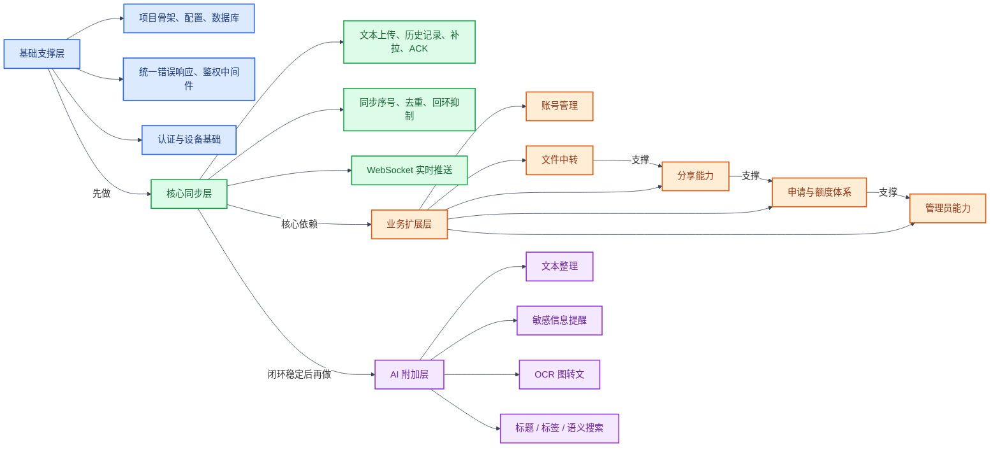
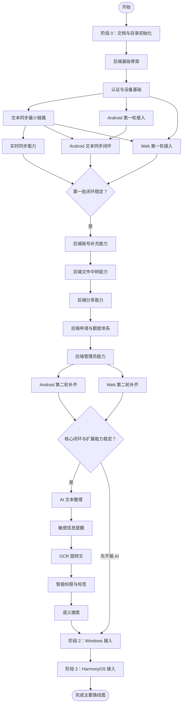

# ClipBridge 开发路线图

## 1. 总体顺序

本项目严格按照下面的顺序推进：

1. 后端 + Android + Web 联合开发
2. Windows
3. HarmonyOS

这个顺序的原因是：

- 后端、Android、Web 三者之间依赖最强，联合推进效率更高
- Android 最适合最早验证真实剪切板同步链路
- Web 可以尽早复用后端接口，提前形成可展示的管理端
- Windows 端桌面特性和打包复杂度较高，适合放在第二阶段
- HarmonyOS 可以尽量复用前面已经稳定的接口和页面思路，放最后成本最低

## 2. 阶段 0：项目初始化（已完成）

### 目标

- 写清需求、架构、路线图
- 建立顶层目录结构
- 明确旧项目参考范围

### 当前产出

- `README.md`
- `docs/requirement.md`
- `docs/architecture.md`
- `docs/roadmap.md`

## 3. 功能分解树

下面先把当前功能清单整理成一个更粗粒度的项目级分解树。
这一版不再拆到太细的接口级功能，而是按“模块分组 + 依赖关系”展示，方便做排期和讲解。

```mermaid
%%{init: {'theme': 'base', 'themeVariables': { 'fontFamily': 'Microsoft YaHei', 'fontSize': '18px', 'textColor': '#111827', 'lineColor': '#374151', 'edgeLabelBackground': '#ffffff' }}}%%
flowchart LR
    Base["基础支撑层"]
    Base --> Base1["项目骨架、配置、数据库"]
    Base --> Base2["统一错误响应、鉴权中间件"]
    Base --> Base3["认证与设备基础"]

    Sync["核心同步层"]
    Sync --> Sync1["文本上传、历史记录、补拉、ACK"]
    Sync --> Sync2["同步序号、去重、回环抑制"]
    Sync --> Sync3["WebSocket 实时推送"]

    Biz["业务扩展层"]
    Biz --> Biz1["账号管理"]
    Biz --> Biz2["文件中转"]
    Biz --> Biz3["分享能力"]
    Biz --> Biz4["申请与额度体系"]
    Biz --> Biz5["管理员能力"]

    AI["AI 附加层"]
    AI --> AI1["文本整理"]
    AI --> AI2["敏感信息提醒"]
    AI --> AI3["OCR 图转文"]
    AI --> AI4["标题 / 标签 / 语义搜索"]

    Base -->|先做| Sync
    Sync -->|核心依赖| Biz
    Sync -->|闭环稳定后再做| AI
    Biz2 -->|支撑| Biz3
    Biz3 -->|支撑| Biz4
    Biz4 -->|支撑| Biz5

    classDef backend fill:#dbeafe,stroke:#2563eb,color:#1e3a8a,stroke-width:2px;
    classDef sync fill:#dcfce7,stroke:#16a34a,color:#166534,stroke-width:2px;
    classDef biz fill:#ffedd5,stroke:#ea580c,color:#9a3412,stroke-width:2px;
    classDef ai fill:#f3e8ff,stroke:#9333ea,color:#6b21a8,stroke-width:2px;

    class Base,Base1,Base2,Base3 backend;
    class Sync,Sync1,Sync2,Sync3 sync;
    class Biz,Biz1,Biz2,Biz3,Biz4,Biz5 biz;
    class AI,AI1,AI2,AI3,AI4 ai;
```

## 4. 开发安排流程图

下面把开发安排按“先依赖底层、再接入上层、最后补扩展”的顺序整理成流程图，便于后续排期时直接参考。

```mermaid
flowchart TD
    Start([开始]) --> R0["阶段 0：文档与目录初始化"]
    R0 --> B1["后端基础骨架"]
    B1 --> B2["认证与设备基础"]
    B2 --> B3["文本同步最小链路"]
    B3 --> B4["实时同步能力"]

    B2 --> A1["Android 第一轮接入"]
    B3 --> A2["Android 文本同步闭环"]
    A1 --> A2

    B2 --> W1["Web 第一轮接入"]
    B3 --> W1

    B4 --> Gate1{"第一批闭环稳定？"}
    A2 --> Gate1
    W1 --> Gate1

    Gate1 -->|是| E1["后端账号补充能力"]
    E1 --> E2["后端文件中转能力"]
    E2 --> E3["后端分享能力"]
    E3 --> E4["后端申请与额度体系"]
    E4 --> E5["后端管理员能力"]

    E5 --> A3["Android 第二轮补齐"]
    E5 --> W2["Web 第二轮补齐"]

    A3 --> Gate2{"核心闭环与扩展能力稳定？"}
    W2 --> Gate2

    Gate2 -->|是| AI1["AI 文本整理"]
    AI1 --> AI2["敏感信息提醒"]
    AI2 --> AI3["OCR 图转文"]
    AI3 --> AI4["智能标题与标签"]
    AI4 --> AI5["语义搜索"]

    Gate2 -->|先不做 AI| Win["阶段 2：Windows 接入"]
    AI5 --> Win
    Win --> Harmony["阶段 3：HarmonyOS 接入"]
    Harmony --> End([完成主要路线图])
```

## 5. 阶段 1：后端 + Android + Web 联合开发

第一阶段不是完全串行，而是后端、Android、Web 联合推进。
不过实际依赖关系仍然是以后端接口为核心，Android 优先打通同步闭环，Web 优先打通管理后台骨架。

### 1.1 第一批必须完成

第一批的目标不是把所有功能铺开，而是先打通“账号登录 + 文本同步 + 历史记录 + 基础管理页面”的最小闭环。
实现顺序必须按依赖推进，避免先写上层页面、后补底层接口。

#### 第 1 步：后端基础骨架（5.22已完成）

先完成最基础、最不会返工的部分：

- 创建后端项目骨架
- 配置加载
- 数据库连接
- 健康检查接口
- 统一错误响应格式
- 统一鉴权中间件骨架

这一阶段的目标是让服务可以启动、数据库可以连通、接口有统一返回格式。

#### 第 2 步：认证与设备基础（5.25已完成）

在服务能稳定启动后，先做账号和设备最基础的能力：

- 用户注册
- 用户登录
- Refresh Token 刷新
- 退出登录
- 登录时自动登记当前设备
- 当前账号信息接口
- 设备列表接口

这一阶段完成后，后端、Web 管理端，以及 Android 的登录 / 注册界面就可以先打通认证与设备基础流程。

#### 第 3 步：文本同步最小链路(已完成)

在登录链路可用后，先做最核心的文本同步基础能力：

- 文本剪切板上传接口
- 历史记录查询接口
- 同步补拉接口
- ACK 接口
- 按用户递增的同步序号
- 基础去重字段设计

这里先保证“能同步、能补拉、能查历史”，暂时不追求文件、分享、管理员等扩展能力。

#### 第 4 步：实时同步能力（已完成）

在轮询补拉链路打通后，再补实时能力：

- WebSocket 连接建立
- 登录态校验
- 后端推送新的剪切板事件
- 源设备回环抑制
- 基础心跳与断线重连约定

这样做比一开始就上 WebSocket 更稳，因为即使实时推送还不稳定，系统也已经能靠补拉正常工作。

#### 第 5 步：Android 第一轮接入（已完成）

Android 按下面顺序接入，不要一开始就上后台常驻和复杂入口：

- 创建 Android 项目骨架
- 登录页
- 保存服务地址
- 登录后进入主页面
- 接入当前账号信息读取
- 接入历史记录页
- 支持手动上传一段文本
- 支持手动拉取远端历史

这一步的目标是先验证 Android 和后端的基本通信没有问题。

#### 第 6 步：Android 文本同步闭环（已完成）

在 Android 能稳定登录并请求接口后，再接同步闭环：

- 开启/关闭同步开关
- 监听本地剪切板变化
- 自动上传本地文本
- 自动补拉远端文本
- 写入本地剪切板
- 基础 ACK 回传
- 基础回环抑制

完成后，Android 就能和后端形成最小可演示闭环。

#### 第 7 步：Web 第一轮接入（已完成）

Web 先做管理端骨架和最基础的数据展示，不要第一轮就做复杂页面：

- 创建 Web 项目骨架
- 登录页
- 全局请求封装
- 登录态持久化
- Dashboard 基础信息展示
- 当前账号信息展示
- 剪切板历史页
- 设备管理页

第一轮 Web 只要求能“看”和“基础管理”，不要求一开始就覆盖全部高级功能。

### 1.2 第二批继续补齐

第二批是在第一批闭环稳定后，按“文件 -> 分享 -> 申请 -> 管理员”的顺序逐步补强。
这里不能乱序，因为后面的功能大多依赖前面的数据结构和权限体系。

#### 第 1 步：后端账号补充能力（已完成）

先补账号侧的非核心但常用功能：

- 修改密码
- 账号设置读取与更新
- 更完整的设备管理动作

这一阶段完成后，普通用户侧的账号管理会更完整。

#### 第 2 步：后端文件中转能力（5.31已完成后端和安卓端）

文件能力建议先于分享能力，因为分享功能很可能直接复用文件存储和文件元数据：

- 文件上传
- 文件列表查询
- 文件下载
- 文件删除
- 文件重命名
- 文件大小校验
- 文件类型记录
- 文件来源设备记录

做完这一步后，Android 和 Web 才适合正式接入文件中心。

#### 第 3 步：后端分享能力（5.31已完成后端）

分享功能建议继续按“文本分享先做，文件分享后做”的顺序推进：

- 文本分享创建
- 文本分享列表
- 公开取件页基础访问
- 分享撤销
- 分享过期时间
- 阅后即焚
- 文件分享创建
- 文件分享下载
- 是否允许复制文本
- 加密分享

这里把最复杂的“加密分享”放在最后，避免一开始把分享逻辑做得过重。

#### 第 4 步：后端申请与额度体系（5.31已完成后端）

在普通用户功能基本完整后，再补申请流程：

- 存储配额申请
- 上传/下载带宽申请
- 管理员申请
- 我的申请记录查询

这一步更多是管理能力扩展，不应阻塞前面的核心同步链路。

#### 第 5 步：后端管理员能力（5.31已完成后端）

管理员能力放在第二批较后位置，因为它依赖用户、文件、分享、申请这些数据都已经基本成型：

- 管理员设置读取
- 管理员设置更新
- 用户列表查询
- 用户信息更新
- 用户删除
- 配额申请审批
- 带宽申请审批
- 管理员申请审批

#### 第 6 步：Android 第二轮补齐（已完成）

Android 在后端第二批接口稳定后，再按下面顺序补功能：

- 手动立即同步
- 通知栏前台服务
- 设备管理页
- 账号设置页
- 文件页
- 系统分享上传文本
- 系统分享上传文件
- 选中文本上传

这里先补“同步体验”和“账号管理”，再补系统级分享入口，能减少前期调试压力。

#### 第 7 步：Web 第二轮补齐（已完成）

Web 第二轮按后台管理常见使用路径补齐：

- 文件中心
- 分享管理页
- 账号设置页
- 申请记录页
- 管理员页面

Web 的复杂管理页面应尽量等对应后端接口和数据模型稳定后再展开。

### 1.3 AI 附加功能（暂未完成）

AI 功能属于附加功能，不阻塞主线。
只有在“登录、文本同步、历史记录、基础管理页面”这些核心能力稳定后，才进入 AI 功能开发。

AI 功能建议按下面顺序推进：

#### 第 1 步：AI 文本整理

先做最贴近剪切板核心场景、实现成本最低的能力：

- 文本摘要
- 文本润色
- 文本改写
- 文本翻译
- 提取要点
- 提取待办

建议先在 Web 端落一个操作入口，再补 Android 端。

#### 第 2 步：敏感信息提醒

在文本整理可用后，再补安全相关能力：

- 检测密码、验证码、手机号、邮箱、API Key 等敏感内容
- 在同步前提醒
- 在分享前提醒
- 支持用户确认后继续操作

这一功能很实用，而且和核心同步/分享流程结合紧密。

#### 第 3 步：OCR 图转文

在文本 AI 稳定后，再补图片相关能力：

- 剪切板图片 OCR
- 截图 OCR
- 上传图片 OCR
- OCR 结果继续进入文本整理流程

这一步会让 AI 能力从“只处理文本”扩展到“处理图片里的文字”。

#### 第 4 步：智能标题与标签

在 AI 已经能处理文本和 OCR 后，再补历史记录增强：

- 自动生成标题
- 自动生成分类
- 自动生成标签
- 在历史记录页展示 AI 元数据

这一步主要提升历史记录的整理和检索体验。

#### 第 5 步：语义搜索

最后再补最复杂的能力：

- 用自然语言搜索历史记录
- 支持按语义而不是只按关键词查找
- 结合 AI 标签、摘要、标题提升命中率

语义搜索依赖前面的标题、标签、摘要这些 AI 元数据，因此放在最后最合理。

### 1.4 后端验收标准

- Android 客户端可以完成登录
- Android 客户端可以上传文本并拉取文本历史
- 两台设备之间可以完成文本同步
- 文件中转与分享接口可用
- 基础管理员接口可访问

### 1.5 联合开发验收标准

- 手机可以稳定登录
- 手机复制文本后，后端能收到记录
- 手机能收到其他设备同步过来的文本
- 历史页能正常查看和复制内容
- Web 可以登录并读取当前用户信息
- Web 可以查看历史、设备、文件、分享数据
- Web 可以完成基础管理操作

### 1.6 Web 部署要求

- 部署在 `us2`
- 不影响旧站点 `https://hy-us2.xushuangbo.top:18443/dashboard.html`
- 使用独立域名与独立配置
- 当前建议新地址：`https://clipbridge-us2.xushuangbo.top:18444`

## 6. 阶段 2：Windows

Windows 阶段不是再做一个“老式桌面工具页签版”，而是把当前 Web 管理台和 Android 已有能力完整搬到桌面端。
技术路线固定为 `JavaFX + Maven + jpackage`，明确排除 AI 页面与 AI 接口。

### 6.1 阶段目标

- 把 `windows/` 从空骨架补成可运行、可打包的独立桌面客户端
- 功能范围对齐“当前 Web + Android 已落地能力”
- UI 采用接近 Web 的管理台结构，而不是旧版 Tab 风格
- 桌面端补齐系统剪贴板监听、托盘常驻、开机自启、即时同步
- 所有关键逻辑保持可读、可调试，并补上简体中文注释

### 6.2 第 1 步：工程骨架与本地状态

先把最底层、最不会返工的部分搭好：

- 继续使用 `windows/` 现有 Maven 目录，不切到 WinUI
- `pom.xml` 固定为 Java 21
- 接入 JavaFX `controls`、`swing`
- 网络层统一使用 JDK 自带 `HttpClient` / `WebSocket`
- 保留 `jpackage` 打包脚本与 Inno Setup 安装脚本
- 资源优先复用 `assets/brand/` 和 `assets/illustrations/`

同时把桌面端本地状态文件结构一次定住，避免后续字段反复调整。

本地状态至少要保存：

- 服务地址
- 用户名
- 当前设备 ID
- 当前设备名
- access token / refresh token
- 是否管理员
- 存储配额快照
- 上传 / 下载带宽快照
- `lastAckSeq`
- 同步开关
- 开机自启
- 启动进托盘
- 分享规则

### 6.3 第 2 步：认证与会话恢复

认证页需要参考当前 Web 登录页，而不是简单放几个输入框：

- 品牌区
- 插画区
- 登录 / 注册切换
- 服务地址输入
- 默认设备名 `Windows on <hostname>`
- 登录态失效提示

认证能力必须补齐：

- 登录
- 注册
- `/v1/account/me` 校验当前会话
- `401 -> refresh -> 重试`
- refresh 失败后清理本地会话并回登录页
- 服务地址变更后强制重新登录

这里的重点不是“只要能登录”，而是要避免桌面端出现“看起来已登录，实际 token 已失效”的半登录态。

### 6.4 第 3 步：主壳与页面结构

登录后主壳统一采用 Web 风格管理台布局：

- 左侧固定侧边栏
- 顶部状态栏
- 中央主内容区
- 列表页右侧详情 / 编辑抽屉
- 统一空状态插画

左侧导航固定为：

- 总览
- 历史
- 设备
- 文件
- 分享
- 申请
- 管理（仅管理员可见）
- 设置

各页面职责如下：

#### 6.4.1 总览

- 展示当前账号摘要
- 展示当前设备摘要
- 展示同步状态
- 展示配额与带宽
- 提供“立即同步 / 跳转历史 / 跳转文件 / 跳转分享”等快捷入口

总览页同时承担桌面端的“同步中心”职责，不再保留旧版独立 Tab。

#### 6.4.2 历史

- 统计卡片
- 分页列表
- 右侧详情抽屉
- 手动上传文本
- 复制完整记录
- 刷新
- 上一页 / 下一页

这里继续沿用后端当前能力边界，不补“删除历史记录”这类服务端尚未落地的动作。

#### 6.4.3 设备

- 设备分页列表
- 当前设备高亮
- 设备详情
- 修改设备名
- 强制下线

同样只对齐当前接口，不补“一键下线全部其他设备”这类当前后端没有的操作。

#### 6.4.4 文件

- 概览卡片
- 分页列表
- 右侧详情抽屉
- 文件上传
- 文件下载
- 文件重命名
- 文件删除
- 选择文件上传
- 拖拽上传

#### 6.4.5 分享

- 文本分享 / 文件分享切换
- 本地分享规则持久化
- 分享策略说明
- 状态筛选
- 分页列表
- 撤销分享
- 复制公开链接
- 调用系统浏览器打开公开页

公开匿名取件页仍由 Web 承担，Windows 端只负责创建、管理、复制和打开链接。

#### 6.4.6 申请

- 配额申请
- 带宽申请
- 管理员申请
- 我的申请记录

#### 6.4.7 管理

仅管理员可见，结构参考当前 Web，但桌面端改为可折叠分区：

- 系统设置
- 用户管理
- 配额审批
- 带宽审批
- 管理员审批

#### 6.4.8 设置

- 账号信息
- 服务地址
- 当前设备名
- 修改密码
- 同步开关
- 开机自启
- 启动进托盘
- 退出登录

### 6.5 第 4 步：同步服务与托盘

这是 Windows 阶段最关键的桌面特性部分，必须单独实现：

- 监听系统剪贴板文本变化
- 本机文本变化自动上传
- 远端文本变化自动写回系统剪贴板
- 写回时做回环抑制，避免“刚写回就又上传”
- ACK 推进
- WebSocket 实时推送
- 断线后自动切回 `pullSync`
- 提供“立即同步”手动触发入口

托盘能力必须包含：

- `显示主窗口`
- `立即同步`
- `开关同步`
- `退出`

窗口关闭时默认不是直接退出，而是隐藏到托盘继续后台运行。

### 6.6 第 5 步：文件 / 分享 / 申请 / 管理页面补齐

在主壳与同步底座稳定后，再把业务页全部接齐。
这个顺序仍然遵循第一阶段已经验证过的依赖关系：

1. 先接文件页
2. 再接分享页
3. 再接申请页
4. 最后接管理员页

这样做的原因很简单：

- 分享依赖文件上传和文件元数据
- 申请页依赖账号额度和系统限制快照
- 管理页依赖用户、申请、文件、分享这些数据都已稳定

### 6.7 第 6 步：开机自启与打包

桌面端最终交付不能只停留在“IDE 能跑”，还需要补齐安装与启动行为：

- 开机自启写入 `HKCU\Software\Microsoft\Windows\CurrentVersion\Run`
- 自启命令固定带 `--start-in-tray`
- 支持 `mvn test`
- 支持 `mvn -DskipTests package`
- 支持 `scripts/package-windows.ps1`
- 输出可安装包和便携包

### 6.8 阶段验收标准

功能验收至少覆盖下面这些场景：

- Windows 可以作为独立设备登录、注册、退出登录
- 修改服务地址后会清理本地会话并回登录页
- 修改密码可用
- 本机复制文本后会自动上传
- 其他设备复制文本后 Windows 会自动写回本机剪贴板
- 托盘可最小化、恢复、立即同步、开关同步、退出
- 历史记录支持分页、详情查看、复制、手动上传文本
- 文件支持上传、下载、重命名、删除
- 分享支持文本 / 文件创建、状态筛选、撤销、复制链接、浏览器打开
- 申请页支持三类申请与我的记录查看
- 管理页支持系统设置、用户管理和三类审批
- 开机自启和 `--start-in-tray` 行为可验证

### 6.9 当前阶段边界

Windows 阶段当前明确不做下面这些内容：

- AI 页面
- AI 接口
- 历史删除
- 一键下线全部其他设备
- 匿名公开取件页桌面内重做

这样可以保证 Windows 端严格对齐“当前 Web + Android 已经有的能力”，而不是顺手扩出一批后端暂未完成的需求。

## 7. 阶段 3：HarmonyOS

HarmonyOS 最后接入，尽量复用前面已经稳定的接口和页面思路。

### 3.1 目标

- 复用已有后端接口
- 复用 Android 的交互逻辑
- 完成登录、同步、历史、文件、设备管理

### 3.2 验收标准

- 基础同步链路打通
- 与 Android / Web / 后端协议保持一致
- 核心页面可正常演示

## 8. 建议的实现节奏

如果按“先能跑，再完善”的方式推进，建议节奏如下：

1. 后端先做文本同步与认证的最小闭环
2. Android 同步接入，尽快形成真实演示链路
3. Web 同步接入，尽快形成可展示的管理端
4. 后端补文件、分享、管理能力
5. 视时间情况插入 AI 附加功能
6. Windows 接入
7. HarmonyOS 最后接入

这样既符合从简到繁，也更适合结课作业答辩展示。
